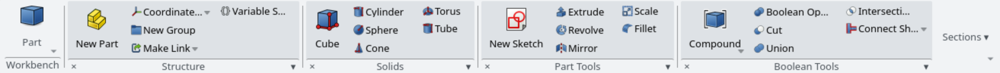

# NeoRibbon

Lightweight Office/Fusion-style ribbon for **FreeCAD 1.1+**. The active workbench’s toolbars become compact side-by-side groups (small bottom titles, 3-row button grid)—not one oversized tab per toolbar. Classic toolbars are hidden while enabled and restored on disable. **No pip packages and no vendored ribbon toolkit.**




## Requirements

- FreeCAD **1.1.0** or newer (Qt6 / PySide via FreeCAD’s `PySide` wrapper)
- No other dependencies

## Important: UI replacement

While NeoRibbon is **enabled**, it intentionally changes FreeCAD’s main-window chrome:

- Classic **toolbars** for the active UI are hidden (mirrored into the ribbon instead)
- Optional: hide the **menu bar** (off by default; Preferences)
- FreeCAD’s workbench selector moves into the ribbon’s **Workbench** control

This is reversible at any time:

| Goal | Action |
|------|--------|
| Turn NeoRibbon off | **Tools → Toggle NeoRibbon** |
| Force classic toolbars back | **Tools → Restore classic toolbars** |
| Preferences | **Edit → Preferences → NeoRibbon** or **Tools → NeoRibbon preferences…** |

NeoRibbon does not phone home or send telemetry. Preferences and usage counts stay in FreeCAD’s local parameter store (`User parameter:BaseApp/Preferences/Mod/NeoRibbon`).

## Install

### Addon Manager (git URL)

1. **Tools → Addon manager**
2. Install from repository: `https://github.com/robdevtech/NeoRibbon`
3. Restart FreeCAD when prompted

After this addon is accepted into the official Addon Index, it will also appear in the Addon Manager browse list.

### Manual (development)

1. Copy or symlink this repository into FreeCAD’s **user Mod** directory, named `NeoRibbon`.

   FreeCAD 1.1+ uses a versioned data directory. Find it with:

   ```python
   # in FreeCAD Python console
   App.getUserAppDataDir()
   ```

   Typical Flatpak path:

   ```bash
   ln -s /path/to/NeoRibbon \
     ~/.var/app/org.freecad.FreeCAD/data/FreeCAD/v1-1/Mod/NeoRibbon
   ```

   Typical native path:

   ```bash
   ln -s /path/to/NeoRibbon ~/.local/share/FreeCAD/v1-1/Mod/NeoRibbon
   ```

   Older layouts may use `.../FreeCAD/Mod/` without the `v1-1` segment — use whatever `App.getUserAppDataDir()` reports, then `Mod/NeoRibbon`.

2. Restart FreeCAD.

3. Confirm the Report View shows `NeoRibbon installed` (log level) and a **NeoRibbon** dock appears at the top.

## Usage

| Action | How |
|--------|-----|
| Toggle ribbon | **Tools → Toggle NeoRibbon** (or run `NeoRibbon_Toggle`) |
| Toggle large section icon | **Tools → Toggle large section icon** (`NeoRibbon_ToggleLargeIcon`) |
| Toggle button text labels | **Tools → Toggle button text labels** (`NeoRibbon_ToggleButtonLabels`) |
| Preferences | **Tools → NeoRibbon preferences…** or **Edit → Preferences → NeoRibbon** |
| Emergency toolbar restore | **Tools → Restore classic toolbars** (`NeoRibbon_RestoreToolbars`) |

Preferences (stored under `User parameter:BaseApp/Preferences/Mod/NeoRibbon`):

- **Enabled** — show ribbon / hide classic toolbars
- **Promote large** — show the first focus command as a large icon per section (default on)
- **Show button labels** — text beside/under focus-strip icons (default on); section dropdowns always keep labels
- **Button size** — `small` \| `medium` \| `large`
- **Visible commands / section** — most-used commands shown as buttons (default 6); the rest are under **More ▾**
- **Ignored toolbars** — semicolon-separated FreeCAD toolbar names to skip permanently
- **Hide menu bar** — optional; default off

**Sections:** click the section footer (except **×**) for a full labeled command list (with shortcuts in parentheses when set); use the **pin** on each row to keep that command in the focus strip. **×** hides the section; **Sections ▾** manages visibility.

**Workbench:** NeoRibbon hides the classic toolbar that held FreeCAD’s workbench combo. Use the **Workbench** control at the **left** of the ribbon instead.

## Design notes

- Content type in `package.xml` is **`other`** (not a Workbench class): the Mod loads from `InitGui.py` and attaches a top dock.
- Only the **active** workbench is inspected (`getToolbarItems`). Other workbenches are never activated for caching.
- Ribbon widgets are plain Qt (`QDockWidget`, `QToolButton`, etc.).
- Classic toolbars are tracked and restored on toggle-off / uninstall path / recovery command.

## Manual test checklist (FreeCAD 1.1+)

1. Install Mod → ribbon appears; classic toolbars are hidden.
2. Switch Part / PartDesign / Draft → ribbon panels update without a long delay.
3. Toggle NeoRibbon off (or run Restore classic toolbars) → toolbars return.
4. Set an ignored toolbar name → that tab is omitted after refresh.
5. Change button size → buttons update on next refresh.
6. Report View shows no cascade of swallowed exceptions from NeoRibbon.

A short automated GUI probe is in [`scripts/smoke_gui.py`](scripts/smoke_gui.py):

```bash
flatpak run org.freecad.FreeCAD /path/to/NeoRibbon/scripts/smoke_gui.py
# expect: NeoRibbon smoke: dock=True / installed=True / panels>0
```

## Support

- Issues: https://github.com/robdevtech/NeoRibbon/issues
- License: LGPL-2.1-or-later — see [LICENSE](LICENSE)
