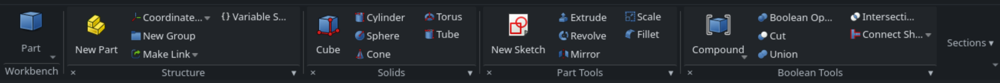

# NeoRibbon

Lightweight Office/Fusion-style ribbon for **FreeCAD 1.1+**. The active workbench’s toolbars become compact side-by-side groups (small bottom titles, 3-row button grid)—not one oversized tab per toolbar. Classic toolbars are hidden while enabled and restored on disable. **No pip packages and no vendored ribbon toolkit.**




## Requirements

- FreeCAD **1.1.0** or newer (Qt6 / PySide via FreeCAD’s `PySide` wrapper)
- No other dependencies

## Important: UI replacement

While NeoRibbon is **enabled**, it intentionally changes FreeCAD’s main-window chrome:

- Classic **toolbars** for the active UI are hidden (mirrored into the ribbon instead)
- FreeCAD’s workbench selector moves into the ribbon’s **Workbench** control

This is reversible at any time:

| Goal | Action | Restart? |
|------|--------|----------|
| Turn NeoRibbon off (keep addon loaded) | **Tools → Toggle NeoRibbon** / toggle shortcut (default **Ctrl+Shift+N**), or uncheck **Enable ribbon** in Preferences then **Apply** | **No** — classic toolbars and the menu bar come back immediately |
| Force classic toolbars back | **Tools → Restore classic toolbars** or restore shortcut (default **Ctrl+Shift+R**) | No |
| Preferences (size, labels, shortcuts, …) | **Edit → Preferences → NeoRibbon**, **Tools → NeoRibbon preferences…**, or preferences shortcut (default **Ctrl+Shift+,**) | No — Apply/OK takes effect immediately |
| Disable or uninstall via **Addon Manager** | AM writes `ADDON_DISABLED` (or deletes the Mod). NeoRibbon restores classic toolbars in the current session | **Yes** — FreeCAD only unloads/loads Mods at startup. First install and AM Enable also need a restart |

NeoRibbon does not phone home or send telemetry. Preferences and usage counts stay in FreeCAD’s local parameter store (`User parameter:BaseApp/Preferences/Mod/NeoRibbon`).

## Install

### Addon Manager (git URL)

1. **Tools → Addon manager**
2. Install from repository: `https://github.com/robdevtech/NeoRibbon`
3. Restart FreeCAD when prompted — **required**. Addon Manager does not load a new Mod (or re-enable one) until the next startup. NeoRibbon cannot show the dock in that same session.

After this addon is accepted into the official Addon Index, it will also appear in the Addon Manager browse list.

### Manual (development)

1. Copy or symlink this repository into FreeCAD’s **user Mod** directory, named `NeoRibbon`.

   FreeCAD 1.1+ uses a versioned data directory. Find it with:

   ```python
   # in FreeCAD Python console
   App.getUserAppDataDir()
   ```

   Typical Flatpak path:

   ```bash
   ln -s /path/to/NeoRibbon \
     ~/.var/app/org.freecad.FreeCAD/data/FreeCAD/v1-1/Mod/NeoRibbon
   ```

   Typical native path:

   ```bash
   ln -s /path/to/NeoRibbon ~/.local/share/FreeCAD/v1-1/Mod/NeoRibbon
   ```

   Older layouts may use `.../FreeCAD/Mod/` without the `v1-1` segment — use whatever `App.getUserAppDataDir()` reports, then `Mod/NeoRibbon`.

2. Restart FreeCAD.

3. Confirm the Report View shows `NeoRibbon installed` (log level) and a **NeoRibbon** dock appears at the top.

## Usage

| Action | How |
|--------|-----|
| Toggle ribbon | **Tools → Toggle NeoRibbon** (`NeoRibbon_Toggle`; default **Ctrl+Shift+N**) |
| Toggle large section icon | **Tools → Toggle large section icon** (`NeoRibbon_ToggleLargeIcon`) |
| Toggle button text labels | **Tools → Toggle button text labels** (`NeoRibbon_ToggleButtonLabels`) |
| Preferences | **Tools → NeoRibbon preferences…** (`NeoRibbon_Preferences`; default **Ctrl+Shift+,**) or **Edit → Preferences → NeoRibbon** |
| Emergency toolbar restore | **Tools → Restore classic toolbars** (`NeoRibbon_RestoreToolbars`; default **Ctrl+Shift+R**) |

Preferences (stored under `User parameter:BaseApp/Preferences/Mod/NeoRibbon`):

- **Enabled** — show ribbon / hide classic toolbars (**Apply** / **OK** update the live UI)
- **Version** — `NeoRibbon x.y.z` from `package.xml` (bottom of the preferences page and Tools dialog)
- **Promote large** — show the first focus command as a large icon per section (default on)
- **Show button labels** — text beside/under focus-strip icons (default on); section dropdowns always keep labels
- **Button size** — `small` \| `medium` \| `large`
- **Visible commands / section** — most-used commands shown as buttons (default 6); the rest are under **More ▾**
- **Ignored toolbars** — semicolon-separated FreeCAD toolbar names to skip permanently
- **Keyboard shortcuts** — click a field and press keys (or **Reset**) for toggle, restore classic toolbars, and open preferences. Defaults: `Ctrl+Shift+N`, `Ctrl+Shift+R`, `Ctrl+Shift+,`. Empty stored value uses the default. A chord already used by FreeCAD — or by another NeoRibbon shortcut in the same form — is rejected immediately; the previous binding is kept.
- **Section order** — per-workbench group order under `SectionOrder/<workbench>` (semicolon-separated names); new toolbars append after the saved list

**Sections:** click the section footer (except **×**) for a full labeled command list (with shortcuts in parentheses when set); use the **pin** on each row to keep that command in the focus strip. The list stays on-screen if the group is scrolled off the edge. **×** hides the section; **Sections ▾** shows/hides groups and has **Reorder sections…** (checkbox to show/hide; drag or move up/down for order; per workbench). Hidden groups stay in that list so you can turn them back on. **Reset section order** restores the workbench toolbar order.

**Toggles:** ribbon buttons for checkable FreeCAD commands (snap-to-grid, B-spline helpers, and similar) stay visually pressed/checked in sync with the command. Ordinary commands are not faked as toggles.

**Workbench:** NeoRibbon hides the classic toolbar that held FreeCAD’s workbench combo. Use the **Workbench** control at the **left** of the ribbon instead.

## Layout (Addon Academy modern)

Follows the [Structuring](https://freecad.github.io/Addon-Academy/Topics/Structuring/) modern namespaced layout:

```
NeoRibbon/
├─ freecad/NeoRibbon/     # Python package (__init__.py, init.py, init_gui.py, …)
├─ Resources/
│  ├─ Icons/              # SVG icons (package.xml + commands)
│  ├─ Media/              # README screenshots
│  └─ ui/                 # Preferences .ui
├─ LICENSE-Code           # LGPL-2.1-or-later (Python)
├─ LICENSE-Assets         # LGPL-2.1-or-later (icons / media)
├─ package.xml
├─ pyproject.toml         # optional dev deps (freecad-stubs, pyside6)
├─ README.md
└─ scripts/               # local FreeCAD probes (not loaded by FreeCAD)
```

- Content type in `package.xml` is **`other`** (not a Workbench class). FreeCAD still runs namespaced `freecad/NeoRibbon/init_gui.py` (and `init.py`) for `other`.
- No top-level `Init.py` / `InitGui.py`; no Python package code at the Mod root.
- Only the **active** workbench is inspected (`getToolbarItems`). Other workbenches are never activated for caching.
- Ribbon widgets are plain Qt (`QDockWidget`, `QToolButton`, etc.).
- Classic toolbars are restored immediately on toggle-off, Preferences **Enable ribbon** off (**Apply**/**OK**), `uninstall()`, and when Addon Manager writes `ADDON_DISABLED` (file watch — AM has no enable/disable signal in FreeCAD 1.1). The preference observer keeps a long-lived `ParamGet` handle (a temporary wrapper’s destructor detaches observers). Pending hide-timers are cancelled so disable cannot leave an empty toolbar strip. On quit, toolbars are shown again so the next session is not saved with zero chrome if the addon does not load.
- **`init_gui.py`** installs the dock at GUI startup. **`init.py`** only retries install if the main window is already up. First Addon Manager install / AM Enable still need a FreeCAD restart.

## Manual test checklist (FreeCAD 1.1+)

1. Install Mod → ribbon appears; classic toolbars are hidden.
2. Switch Part / PartDesign / Draft → ribbon panels update without a long delay.
3. Toggle NeoRibbon off, or uncheck **Enable ribbon** then **Apply** → classic toolbars NeoRibbon hid return; toolbars you had already hidden stay hidden.
4. Set an ignored toolbar name → that tab is omitted after refresh.
5. Change button size → buttons update on next refresh.
6. Report View shows no cascade of swallowed exceptions from NeoRibbon.
7. **Sections ▾ → Reorder sections…** — uncheck a group then OK to hide it; check to show again; drag or move up/down reorders; reset restores workbench order (visibility is kept).
8. Toggle a checkable command (e.g. Draft snap, Sketcher helper) — ribbon button stays sunken while on.
9. Scroll the ribbon so a group is near the left/right edge, open its ▾ list — popup stays fully on screen.
10. **Edit → Preferences → NeoRibbon** shows **NeoRibbon x.y.z** at the bottom; Apply/OK updates the live ribbon.
11. If a NeoRibbon shortcut is already bound elsewhere, Report View warns and that key is not stolen (Tools menu still works). Change chords under **Edit → Preferences → NeoRibbon** or **Tools → NeoRibbon preferences…**; a used chord is rejected as soon as you press it.

A short automated GUI probe is in [`scripts/smoke_gui.py`](scripts/smoke_gui.py):

```bash
flatpak run org.freecad.FreeCAD /path/to/NeoRibbon/scripts/smoke_gui.py
# expect: NeoRibbon smoke: dock=True / installed=True / panels>0
```

## Support

- Issues: https://github.com/robdevtech/NeoRibbon/issues
- License: LGPL-2.1-or-later — see [LICENSE-Code](LICENSE-Code) and [LICENSE-Assets](LICENSE-Assets)
